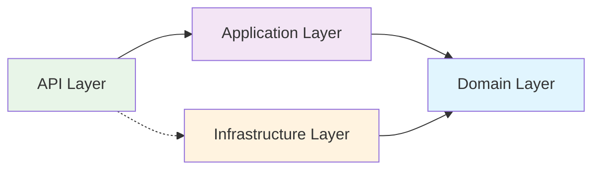

# CT.01 Modular Architecture Documentation

## Обзор

CT.01 использует модульную архитектуру на основе принципов Domain-Driven Design (DDD) с четким разделением обязанностей и чистой архитектурой.

## Архитектурные принципы

### 1. Domain-Driven Design (DDD)
- **Bounded Contexts**: Четкое разделение доменов (например, crypto, user management, trading)
- **Ubiquitous Language**: Единый язык между разработчиками и бизнесом
- **Domain Models**: Богатые доменные модели с бизнес-логикой

### 2. Clean Architecture
- **Domain Layer**: Бизнес-логика и правила, независимые от внешних зависимостей
- **Application Layer**: Сценарии использования и координация между доменами
- **Infrastructure Layer**: Внешние зависимости (базы данных, внешние API)
- **API Layer**: HTTP контроллеры и DTOs

### 3. SOLID Принципы
- **Single Responsibility**: Каждый класс имеет одну ответственность
- **Open/Closed**: Расширяемость без модификации существующего кода
- **Liskov Substitution**: Возможность замены реализаций
- **Interface Segregation**: Интерфейсы специфичны для клиентов
- **Dependency Inversion**: Зависимость от абстракций, а не конкретных реализаций

## Структура модуля

```
com.ct01.{domain}/
├── domain/                    # Доменный слой
│   ├── {Entity}.java         # Доменные сущности (value objects)
│   ├── {Aggregate}.java      # Агрегаты с бизнес-методами
│   ├── repository/           # Доменные репозитории (интерфейсы)
│   │   └── {Entity}Repository.java
│   └── service/              # Доменные сервисы
│       └── {Domain}DomainService.java
├── application/              # Прикладной слой
│   ├── dto/                  # DTOs для application layer
│   │   ├── {Entity}Command.java    # Command DTOs
│   │   ├── {Entity}Query.java      # Query DTOs
│   │   └── {Entity}Result.java     # Result DTOs
│   ├── usecase/              # Use cases / Application Services
│   │   ├── Manage{Entity}UseCase.java
│   │   └── Get{Entity}UseCase.java
│   ├── facade/               # Фасады для интеграции
│   │   └── {Domain}ApplicationFacade.java
│   └── config/               # Configuration
│       └── {Domain}ApplicationConfig.java
├── infrastructure/           # Инфраструктурный слой
│   ├── mapper/               # Мапперы между слоями
│   │   └── {Entity}Mapper.java
│   ├── persistence/          # Реализации репозиториев
│   │   └── {Entity}RepositoryImpl.java
│   └── config/               # Infrastructure configuration
│       └── {Domain}DomainConfig.java
├── api/                      # API слой
│   ├── dto/                  # API DTOs
│   │   ├── Api{Entity}Dto.java
│   │   ├── ApiResponseDto.java
│   │   └── ApiErrorDto.java
│   ├── controller/           # REST контроллеры
│   │   ├── {Entity}ApiController.java
│   │   └── {Domain}ApiController.java
│   └── config/               # API configuration
│       └── {Domain}ApiConfig.java
└── migration/                # Миграционные компоненты (при необходимости)
    ├── MigrationService.java
    ├── LegacyApiAdapter.java
    └── MigrationController.java
```

## Диаграмма архитектуры

```mermaid
graph TB
    subgraph "API Layer"
        AC[API Controllers]
        DTO[API DTOs]
        AC --> DTO
    end
    
    subgraph "Application Layer"
        UC[Use Cases]
        AF[Application Facade]
        CMD[Commands/Queries]
        RES[Results]
        UC --> CMD
        UC --> RES
        AF --> UC
    end
    
    subgraph "Domain Layer"
        ENT[Entities/Value Objects]
        AGG[Aggregates]
        DR[Domain Repositories]
        DS[Domain Services]
        AGG --> ENT
        DS --> DR
        DS --> AGG
    end
    
    subgraph "Infrastructure Layer"
        IMPL[Repository Implementations]
        MAPPER[Mappers]
        JPA[JPA Entities]
        IMPL --> JPA
        MAPPER --> ENT
        MAPPER --> JPA
    end
    
    AC --> AF
    AF --> DS
    DR --> IMPL
    IMPL --> MAPPER
    
    style "Domain Layer" fill:#e1f5fe
    style "Application Layer" fill:#f3e5f5
    style "Infrastructure Layer" fill:#fff3e0
    style "API Layer" fill:#e8f5e8
```

## Пример: Crypto Module

### Domain Layer
```java
// Доменная сущность (Value Object)
public record Coin(
    Long id,
    String symbol,
    String name,
    BigDecimal marketCap,
    boolean isActive,
    LocalDateTime createdAt,
    LocalDateTime updatedAt
) {
    // Валидация в конструкторе
    public Coin {
        if (symbol == null || symbol.isBlank()) {
            throw new IllegalArgumentException("Symbol cannot be null or blank");
        }
    }
}

// Агрегат с бизнес-логикой
public class TrackedCoin {
    private final Long id;
    private final String symbol;
    private boolean isActive;
    private Integer priority;
    
    // Бизнес-методы
    public boolean isHighPriority() {
        return priority != null && priority >= 8;
    }
    
    public void activate() {
        this.isActive = true;
    }
    
    public void deactivate() {
        this.isActive = false;
    }
}

// Доменный репозиторий (интерфейс)
public interface CoinRepository {
    Optional<Coin> findBySymbol(String symbol);
    List<Coin> findActiveCoins();
    List<Coin> searchByNameOrSymbol(String query);
}

// Доменный сервис
public class CoinDomainService {
    public List<TrackedCoin> getHighPriorityActiveCoins(
        List<TrackedCoin> trackedCoins) {
        return trackedCoins.stream()
            .filter(TrackedCoin::isActive)
            .filter(TrackedCoin::isHighPriority)
            .toList();
    }
}
```

### Application Layer
```java
// Command
public record CreateTrackedCoinCommand(
    String symbol,
    String name,
    Set<TrackedCoin.Exchange> exchanges,
    Set<String> quoteCurrencies,
    Boolean isActive,
    Integer priority
) {}

// Use Case
@Service
public class ManageCoinTrackingUseCase {
    public TrackedCoinOperationResult createTrackedCoin(
        CreateTrackedCoinCommand command) {
        
        // Валидация
        // Бизнес-логика
        // Сохранение
        
        return TrackedCoinOperationResult.success(savedCoin);
    }
}

// Application Facade
@Service
public class CryptoApplicationFacade {
    public TrackedCoinOperationResult createTrackedCoin(
        String symbol, String name, ...) {
        
        CreateTrackedCoinCommand command = new CreateTrackedCoinCommand(...);
        return manageCoinTrackingUseCase.createTrackedCoin(command);
    }
}
```

### Infrastructure Layer
```java
// Mapper
public class CoinMapper {
    public Coin toDomain(alg.coyote001.entity.Coin jpaEntity) {
        return new Coin(
            jpaEntity.getId(),
            jpaEntity.getSymbol(),
            jpaEntity.getName(),
            jpaEntity.getMarketCap(),
            jpaEntity.getIsActive(),
            jpaEntity.getCreatedAt(),
            jpaEntity.getUpdatedAt()
        );
    }
    
    public alg.coyote001.entity.Coin toJpa(Coin domain) {
        // Конвертация domain -> JPA entity
    }
}

// Repository Implementation
@Repository
public class CoinRepositoryImpl implements CoinRepository {
    private final alg.coyote001.repository.CoinRepository jpaCoinRepository;
    private final CoinMapper coinMapper;
    
    @Override
    public Optional<Coin> findBySymbol(String symbol) {
        return jpaCoinRepository.findBySymbolIgnoreCase(symbol)
            .map(coinMapper::toDomain);
    }
}
```

### API Layer
```java
// API DTO
public class ApiCoinDto {
    @NotBlank(message = "Symbol is required")
    private String symbol;
    
    @NotBlank(message = "Name is required")
    private String name;
    
    // Getters/Setters
}

// API Controller
@RestController
@RequestMapping("/api/v1/crypto/coins")
public class CoinApiController {
    private final CryptoApplicationFacade cryptoApplicationFacade;
    
    @GetMapping("/{symbol}")
    public ResponseEntity<ApiResponseDto<ApiCoinDto>> getCoin(
        @PathVariable String symbol) {
        
        Optional<CoinResult.CoinResult> result = 
            cryptoApplicationFacade.getCoinBySymbol(symbol);
            
        return result.map(coin -> ResponseEntity.ok(
            ApiResponseDto.success(convertToApiDto(coin.coin()))
        )).orElse(ResponseEntity.notFound().build());
    }
}
```

## Ключевые преимущества архитектуры

### 1. Разделение ответственности
- Каждый слой имеет четко определенную роль
- Бизнес-логика изолирована в domain layer
- Инфраструктурные детали скрыты за интерфейсами

### 2. Тестируемость
- Domain layer легко unit тестируется
- Use cases тестируются без внешних зависимостей
- Integration тесты на уровне API

### 3. Масштабируемость
- Модули могут разрабатываться независимо
- Легкое добавление новых доменов
- Горизонтальное масштабирование по модулям

### 4. Поддерживаемость
- Четкая структура упрощает понимание кода
- Изменения локализованы в рамках слоя
- Легкое рефакторинг и расширение

### 5. Миграционная стратегия
- Постепенная миграция legacy кода
- Адаптеры для обратной совместимости
- Мониторинг процесса миграции

## Зависимости между слоями



**Правила зависимостей:**
- API Layer зависит от Application Layer
- Application Layer зависит от Domain Layer
- Infrastructure Layer зависит от Domain Layer (реализует интерфейсы)
- Domain Layer НЕ зависит от других слоев (чистый)

## Конфигурация Spring

### Domain Configuration
```java
@Configuration
public class CryptoDomainConfig {
    @Bean
    public CoinDomainService coinDomainService(
        CoinRepository coinRepository,
        TrackedCoinRepository trackedCoinRepository) {
        return new CoinDomainService(coinRepository, trackedCoinRepository);
    }
    
    @Bean
    public CoinRepository coinRepository(
        alg.coyote001.repository.CoinRepository jpaCoinRepository,
        CoinMapper coinMapper) {
        return new CoinRepositoryImpl(jpaCoinRepository, coinMapper);
    }
}
```

### Application Configuration
```java
@Configuration
public class CryptoApplicationConfig {
    @Bean
    public ManageCoinTrackingUseCase manageCoinTrackingUseCase(
        CoinDomainService coinDomainService,
        TrackedCoinRepository trackedCoinRepository) {
        return new ManageCoinTrackingUseCase(coinDomainService, trackedCoinRepository);
    }
}
```

## Паттерны и практики

### 1. Repository Pattern
- Интерфейсы в domain layer
- Реализации в infrastructure layer
- Инкапсуляция логики доступа к данным

### 2. Facade Pattern
- Упрощение интеграции между слоями
- Единая точка входа для use cases
- Скрытие сложности от API layer

### 3. Command/Query Separation
- Отдельные DTOs для команд и запросов
- Четкое разделение операций чтения и записи
- Типобезопасность

### 4. Value Objects
- Immutable объекты для данных
- Валидация в конструкторе
- Отсутствие identity, только значения

### 5. Aggregates
- Инкапсуляция бизнес-инвариантов
- Контроль доступа к внутренним объектам
- Транзакционные границы

## Лучшие практики

### 1. Именование
- Используйте ubiquitous language
- Четкие и описательные имена
- Суффиксы для типов (Service, Repository, UseCase)

### 2. Валидация
- Domain validation в конструкторах value objects
- Application validation в use cases
- API validation с аннотациями

### 3. Обработка ошибок
- Domain exceptions для бизнес-ошибок
- Result objects для операций
- Centralized exception handling в API layer

### 4. Тестирование
- Unit тесты для domain logic
- Integration тесты для use cases
- API тесты для controllers

### 5. Документация
- Swagger/OpenAPI для API
- Javadoc для public interfaces
- Архитектурные решения в ADR формате

## Миграционная стратегия

### Phase 1: Parallel Operation
- Legacy и новый API работают параллельно
- Adapter pattern для совместимости
- Логирование использования

### Phase 2: Deprecation
- Legacy API помечается как deprecated
- Предупреждения в ответах
- Документация миграции

### Phase 3: New API Only
- Отключение legacy API
- Полный переход на новую архитектуру
- Очистка устаревшего кода

## Мониторинг и метрики

### 1. Бизнес-метрики
- Использование API endpoints
- Время отклика по модулям
- Ошибки по типам операций

### 2. Технические метрики
- Производительность слоев
- Использование памяти
- Загрузка базы данных

### 3. Миграционные метрики
- Процент использования новых API
- Количество legacy вызовов
- Ошибки адаптации

Эта архитектура обеспечивает масштабируемость, поддерживаемость и гибкость для дальнейшего развития системы CT.01. 