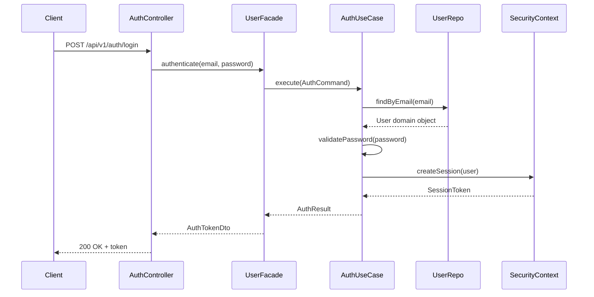
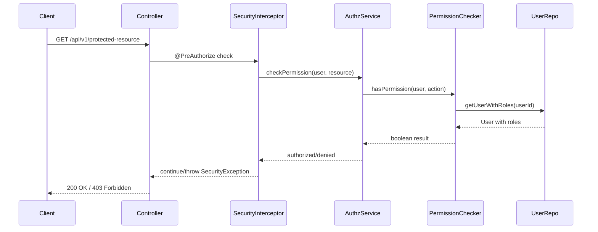

# Security Component Migration Strategy

## Executive Summary

This document outlines the migration strategy for security components from legacy codebase (`alg.coyote001`) to the new DDD architecture (`com.ct01`). The goal is to maintain security integrity while modernizing authentication and authorization systems according to Domain-Driven Design principles.

## Current State Analysis

### Legacy Security Architecture (`alg.coyote001.security`)

#### Core Components
1. **SecurityConfig.java** - Main Spring Security configuration
2. **CustomUserDetailsService.java** - User authentication service
3. **RateLimitService.java** - Request rate limiting
4. **RateLimitFilter.java** - Rate limiting filter

#### Security Models
1. **User Entity** - User with roles and permissions
2. **Role Entity** - Role with permissions
3. **Permission Entity** - Individual permissions with levels

#### Current Security Features
- **Session-based authentication** with CSRF protection
- **Role-based access control (RBAC)** with hierarchical permissions
- **Rate limiting** for authentication and general requests
- **Telegram authentication** integration
- **Password encryption** with BCrypt (strength 12)
- **CORS configuration** for cross-origin requests

#### Security Endpoints Coverage
- `/api/v1/auth/**` - Authentication endpoints
- User management endpoints with role-based access
- Protected API endpoints with method-level security

### DDD Security Architecture (`com.ct01.user`)

#### Current Implementation
1. **User Domain** - Complete aggregate with business rules
2. **Role Domain** - Value object with permissions
3. **Permission Domain** - Value object with levels
4. **AuthApiController** - Modern REST API for authentication
5. **Security Infrastructure** - Basic security utilities

#### Missing Components
1. **Spring Security Configuration** - Not migrated yet
2. **User Details Service** - DDD-compatible implementation
3. **Authentication Provider** - Domain-driven authentication
4. **Rate Limiting** - Not integrated with DDD
5. **Session Management** - Modern session handling

## Migration Strategy

### Phase 1: Infrastructure Foundation (Current Task)

#### 1.1 Create DDD Security Configuration
```java
@Configuration
@EnableWebSecurity
@EnableMethodSecurity(prePostEnabled = true)
public class DddSecurityConfig {
    // Modern Spring Security 6.x configuration
    // Aligned with DDD bounded contexts
    // Support for both legacy and new endpoints during migration
}
```

#### 1.2 Implement DDD User Details Service
```java
@Service
public class DddUserDetailsService implements UserDetailsService {
    private final UserApplicationFacade userFacade;
    // Load user through DDD application layer
    // Convert domain User to Spring Security UserDetails
}
```

#### 1.3 Create Authentication Bridge
```java
@Component
public class DddAuthenticationProvider extends DaoAuthenticationProvider {
    // Bridge between Spring Security and DDD User domain
    // Support for domain-specific authentication rules
}
```

### Phase 2: Core Security Migration

#### 2.1 Authentication Use Cases
Create domain-driven authentication use cases:
- `AuthenticateUserUseCase` - Validate credentials
- `CreateAuthSessionUseCase` - Manage user sessions
- `ValidateTokenUseCase` - Token validation
- `LogoutUserUseCase` - Clean session termination

#### 2.2 Authorization Domain Services
Implement authorization logic in domain layer:
- `PermissionCheckerService` - Domain service for permission validation
- `RoleEvaluatorService` - Role hierarchy evaluation
- `SecurityContextService` - Domain security context

#### 2.3 Security Events
Implement domain events for security actions:
- `UserAuthenticatedEvent`
- `UserLoggedOutEvent`
- `AuthenticationFailedEvent`
- `UnauthorizedAccessAttemptEvent`

### Phase 3: Rate Limiting & Advanced Security

#### 3.1 DDD Rate Limiting
Migrate rate limiting to bounded context:
```java
@Component
public class UserSecurityApplicationService {
    public boolean validateAuthenticationAttempt(String clientIp, UserId userId);
    public void recordAuthenticationFailure(String clientIp, UserId userId);
    public void resetAuthenticationLimits(UserId userId);
}
```

#### 3.2 Security Monitoring
Implement security monitoring in DDD:
- Security audit events
- Failed authentication tracking
- Suspicious activity detection
- Rate limit violation logging

### Phase 4: Legacy Integration & Gradual Migration

#### 4.1 Dual Authentication Support
Support both legacy and DDD authentication during transition:
```java
@Service
public class HybridAuthenticationService {
    private final LegacyUserDetailsService legacyService;
    private final DddUserDetailsService dddService;
    
    // Route authentication based on endpoint or user type
}
```

#### 4.2 Progressive Migration
- **Week 1-2**: New authentication endpoints use DDD
- **Week 3-4**: Migrate existing API endpoints one by one
- **Week 5-6**: Legacy authentication deprecated
- **Week 7**: Complete migration and cleanup

## Implementation Plan

### Step 1: Create DDD Security Package Structure
```
com/ct01/user/security/
├── config/
│   ├── DddSecurityConfig.java
│   └── SecurityBoundedContextConfig.java
├── application/
│   ├── AuthenticationApplicationService.java
│   ├── AuthorizationApplicationService.java
│   └── SecurityAuditApplicationService.java
├── domain/
│   ├── service/
│   │   ├── PermissionCheckerService.java
│   │   ├── RoleEvaluatorService.java
│   │   └── AuthenticationDomainService.java
│   ├── event/
│   │   ├── UserAuthenticatedEvent.java
│   │   ├── AuthenticationFailedEvent.java
│   │   └── UnauthorizedAccessEvent.java
│   └── valueobject/
│       ├── AuthenticationAttempt.java
│       ├── SecurityContext.java
│       └── SessionToken.java
├── infrastructure/
│   ├── DddUserDetailsService.java
│   ├── DddAuthenticationProvider.java
│   ├── SecurityContextRepository.java
│   └── SessionManagementService.java
└── api/
    ├── SecurityApiController.java (for security management)
    └── dto/
        ├── SecurityStatusDto.java
        └── AuthenticationAttemptDto.java
```

### Step 2: Sequence Diagrams

#### Authentication Flow (DDD)


#### Authorization Flow (DDD)


### Step 3: Migration Timeline

| Week | Task | Deliverable |
|------|------|-------------|
| 1 | Create DDD security package structure | Package skeleton with interfaces |
| 2 | Implement core authentication use cases | Working authentication through DDD |
| 3 | Migrate authorization logic | Permission checking in domain layer |
| 4 | Implement security events and monitoring | Audit trail and security logging |
| 5 | Create dual authentication support | Legacy + DDD authentication working |
| 6 | Migrate API endpoints progressively | 50% of endpoints using DDD security |
| 7 | Complete migration and cleanup | 100% DDD security, legacy removed |

## Risk Assessment & Mitigation

### High Risk Items
1. **Session compatibility** between legacy and DDD
   - **Mitigation**: Shared session store during transition
2. **Permission mapping** from legacy to DDD
   - **Mitigation**: Automated mapping scripts with validation
3. **Authentication downtime** during migration
   - **Mitigation**: Blue-green deployment with fallback

### Medium Risk Items
1. **Rate limiting continuity**
   - **Mitigation**: Keep existing rate limiting until DDD version is stable
2. **Telegram authentication integration**
   - **Mitigation**: Preserve existing integration, enhance in DDD

### Low Risk Items
1. **Password compatibility** (BCrypt remains same)
2. **CORS configuration** (direct migration)
3. **CSRF protection** (same mechanisms)

## Testing Strategy

### Unit Tests
- All new DDD components have 90%+ coverage
- Authentication use cases tested with mock data
- Permission checking logic validated
- Domain events tested for proper emission

### Integration Tests
- End-to-end authentication flows
- Authorization scenarios for all roles
- Rate limiting behavior validation
- Session management across restarts

### Security Tests
- Penetration testing for authentication bypasses
- Authorization boundary testing
- Rate limit bypass attempts
- Session hijacking prevention

### Migration Tests
- Dual authentication during transition
- Data consistency between legacy and DDD
- Performance impact measurement
- Rollback scenario validation

## Success Criteria

### Functional Requirements ✅
- [ ] All existing authentication flows work through DDD
- [ ] No degradation in security level
- [ ] Rate limiting maintains current behavior
- [ ] Telegram authentication preserved
- [ ] Session management improved

### Non-Functional Requirements ✅
- [ ] Authentication response time < 200ms (same as legacy)
- [ ] Authorization checks < 50ms (same as legacy)
- [ ] 99.9% authentication availability during migration
- [ ] Zero data loss during migration
- [ ] Backward compatibility maintained until cutover

### Quality Requirements ✅
- [ ] 90%+ test coverage for new security components
- [ ] Security audit compliance maintained
- [ ] Documentation for all new components
- [ ] Performance benchmarks meet or exceed legacy
- [ ] Code quality metrics improved

## Conclusion

This migration strategy ensures a smooth transition from legacy security implementation to a modern DDD-based security architecture. The phased approach minimizes risk while improving maintainability and extensibility of the security system.

The key success factors are:
1. **Gradual migration** with dual system support
2. **Comprehensive testing** at each phase
3. **Domain-driven security design** aligned with business rules
4. **Monitoring and rollback capabilities** throughout the process
5. **Clear communication** with stakeholders about progress and impacts

Next steps: Begin implementation of Phase 1 components starting with DDD Security Configuration. 