# System Architecture

<div align="center">


**Comprehensive Architecture Guide для платформы CT.01**

</div>

## 📖 Содержание

- [Общий обзор архитектуры](#-общий-обзор-архитектуры)
- [Компоненты системы](#-компоненты-системы)
- [Backend архитектура](#-backend-архитектура)
- [Frontend архитектура](#-frontend-архитектура)
- [База данных](#-база-данных)
- [Система безопасности](#-система-безопасности)
- [Интеграции](#-интеграции)
- [Развертывание](#-развертывание)
- [Мониторинг и логирование](#-мониторинг-и-логирование)
- [Scalability Strategy](#-scalability-strategy)

---

## 🏗️ Общий обзор архитектуры

### High-Level Architecture

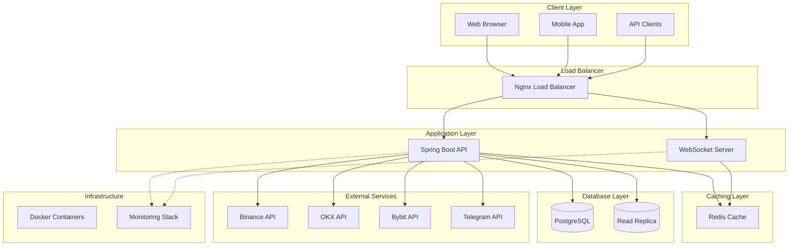

### Technology Stack

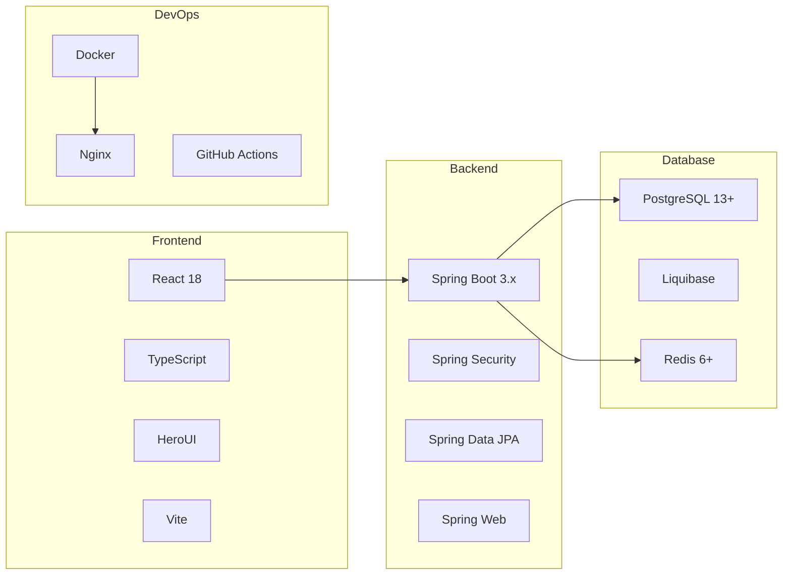

---

## 🎯 Компоненты системы

### Core Services Architecture

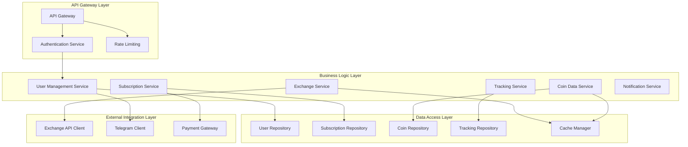

### Component Responsibilities

| Component | Responsibility | Technologies |
|-----------|----------------|--------------|
| **API Gateway** | Request routing, authentication, rate limiting | Spring Boot, Spring Security |
| **User Management** | User CRUD, profiles, roles | Spring Data JPA, PostgreSQL |
| **Subscription Service** | Plans, billing, usage tracking | Spring Boot, Payment APIs |
| **Coin Data Service** | Price data, market data, caching | Redis, External APIs |
| **Exchange Service** | Multi-exchange integration, arbitrage | WebClient, Circuit Breaker |
| **Tracking Service** | Price alerts, user preferences | Spring Events, Async Processing |
| **Notification Service** | Real-time notifications | WebSocket, Telegram Bot API |

---

## 🚀 Backend архитектура

### Layered Architecture Pattern

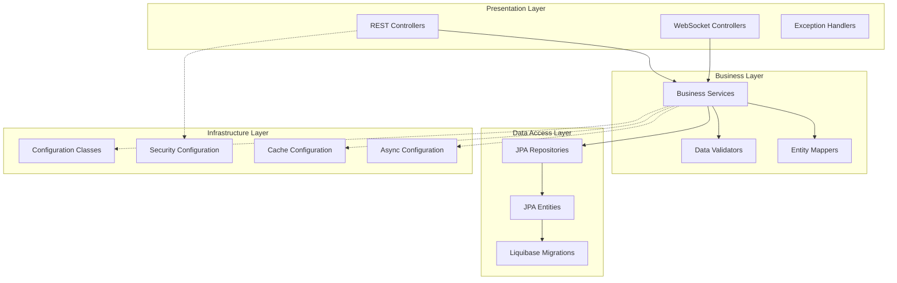

### Package Structure

```
backend/src/main/java/alg/coyote001/
├── controller/           # REST API Controllers
│   ├── AuthController.java
│   ├── UserManagementController.java
│   ├── SubscriptionController.java
│   └── CoinDataController.java
├── service/             # Business Logic
│   ├── impl/           # Service Implementations
│   ├── UserService.java
│   ├── SubscriptionService.java
│   └── CoinDataService.java
├── repository/          # Data Access
│   ├── UserRepository.java
│   ├── SubscriptionRepository.java
│   └── CoinDataRepository.java
├── entity/             # JPA Entities
│   ├── User.java
│   ├── Subscription.java
│   └── CoinData.java
├── dto/                # Data Transfer Objects
│   ├── request/
│   ├── response/
│   └── mapper/
├── config/             # Configuration
│   ├── SecurityConfig.java
│   ├── RedisConfig.java
│   └── WebSocketConfig.java
├── exception/          # Exception Handling
│   ├── GlobalExceptionHandler.java
│   └── custom/
└── util/              # Utilities
    ├── JwtUtil.java
    └── ValidationUtil.java
```

### Request Processing Flow

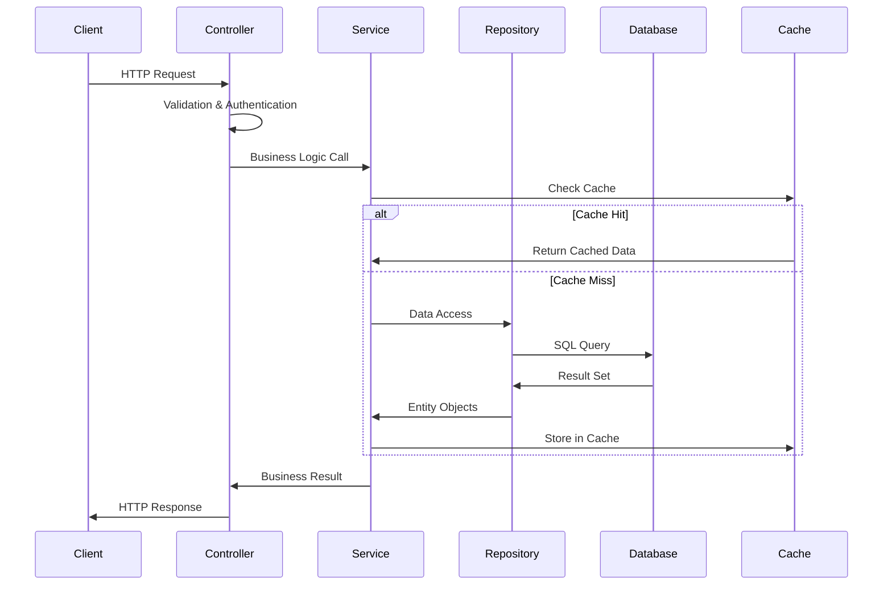

---

## 🎨 Frontend архитектура

### Component Architecture

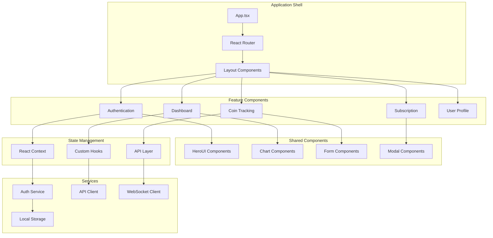

### Folder Structure

```
frontend/src/
├── components/          # Reusable Components
│   ├── ui/             # Basic UI Components
│   ├── charts/         # Chart Components
│   ├── forms/          # Form Components
│   └── layout/         # Layout Components
├── pages/              # Page Components
│   ├── auth/           # Authentication Pages
│   ├── dashboard/      # Dashboard Pages
│   ├── coins/          # Coin Tracking Pages
│   └── subscription/   # Subscription Pages
├── hooks/              # Custom React Hooks
│   ├── useAuth.ts
│   ├── useWebSocket.ts
│   └── useSubscription.ts
├── services/           # API Services
│   ├── authService.ts
│   ├── coinService.ts
│   └── subscriptionService.ts
├── context/            # React Context
│   ├── AuthContext.tsx
│   └── ThemeContext.tsx
├── types/              # TypeScript Types
│   ├── auth.ts
│   ├── coin.ts
│   └── subscription.ts
├── utils/              # Utility Functions
│   ├── validation.ts
│   ├── formatting.ts
│   └── constants.ts
└── assets/             # Static Assets
    ├── images/
    └── icons/
```

### Data Flow Architecture

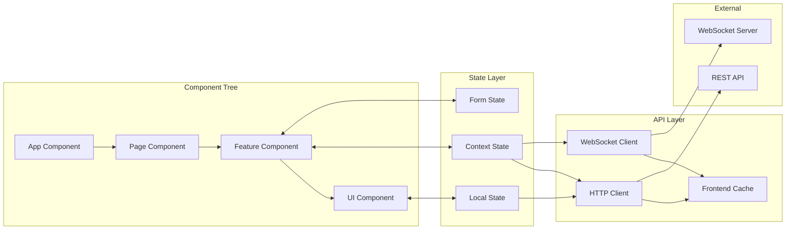

---

## 🗄️ База данных

### Database Schema Overview

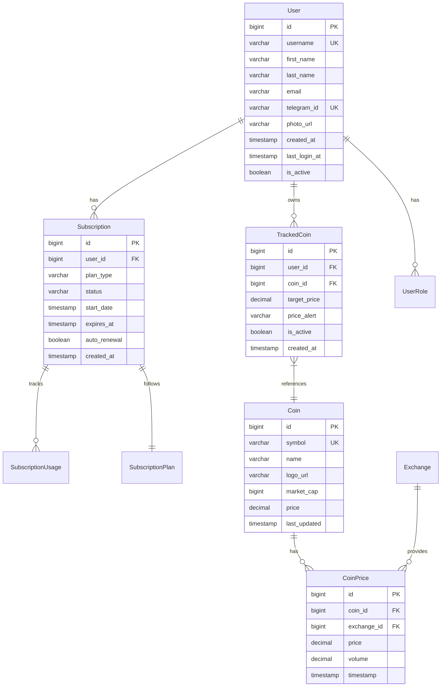

### Database Performance Strategy

```mermaid
graph TB
    subgraph "Read Performance"
        READ_REPLICA[(Read Replica)]
        QUERY_CACHE[Query Result Cache]
        INDEX_OPT[Index Optimization]
    end
    
    subgraph "Write Performance"
        CONN_POOL[Connection Pooling]
        BATCH_WRITES[Batch Writes]
        ASYNC_WRITES[Async Processing]
    end
    
    subgraph "Caching Strategy"
        REDIS_CACHE[Redis Cache]
        APP_CACHE[Application Cache]
        QUERY_CACHE_2[Query Cache]
    end
    
    subgraph "Monitoring"
        SLOW_QUERY[Slow Query Log]
        PERF_MONITOR[Performance Monitor]
        INDEX_ADVISOR[Index Advisor]
    end
    
    READ_REPLICA --> QUERY_CACHE
    QUERY_CACHE --> INDEX_OPT
    
    CONN_POOL --> BATCH_WRITES
    BATCH_WRITES --> ASYNC_WRITES
    
    REDIS_CACHE --> APP_CACHE
    APP_CACHE --> QUERY_CACHE_2
    
    SLOW_QUERY --> PERF_MONITOR
    PERF_MONITOR --> INDEX_ADVISOR
```

### Critical Database Indexes

```sql
-- User authentication optimization
CREATE INDEX idx_user_telegram_id ON users(telegram_id);
CREATE INDEX idx_user_email ON users(email);
CREATE INDEX idx_user_active ON users(is_active) WHERE is_active = true;

-- Subscription queries optimization  
CREATE INDEX idx_subscription_user_status ON subscriptions(user_id, status);
CREATE INDEX idx_subscription_expires ON subscriptions(expires_at) WHERE status = 'ACTIVE';

-- Coin data optimization
CREATE INDEX idx_coin_symbol ON coins(symbol);
CREATE INDEX idx_coin_price_timestamp ON coin_prices(coin_id, timestamp DESC);
CREATE INDEX idx_coin_price_exchange ON coin_prices(exchange_id, coin_id, timestamp DESC);

-- Tracking optimization
CREATE INDEX idx_tracked_coin_user_active ON tracked_coins(user_id, is_active);
CREATE INDEX idx_tracked_coin_price_alert ON tracked_coins(coin_id, price_alert, is_active);

-- Performance monitoring
CREATE INDEX idx_subscription_usage_period ON subscription_usage(user_id, period_start, period_end);
```

---

## 🔒 Система безопасности

### Security Architecture

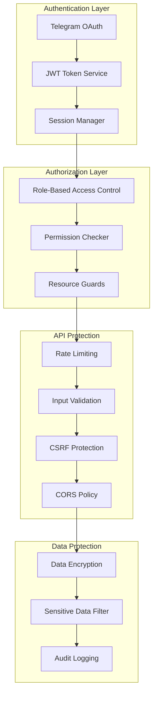

### Authentication Flow

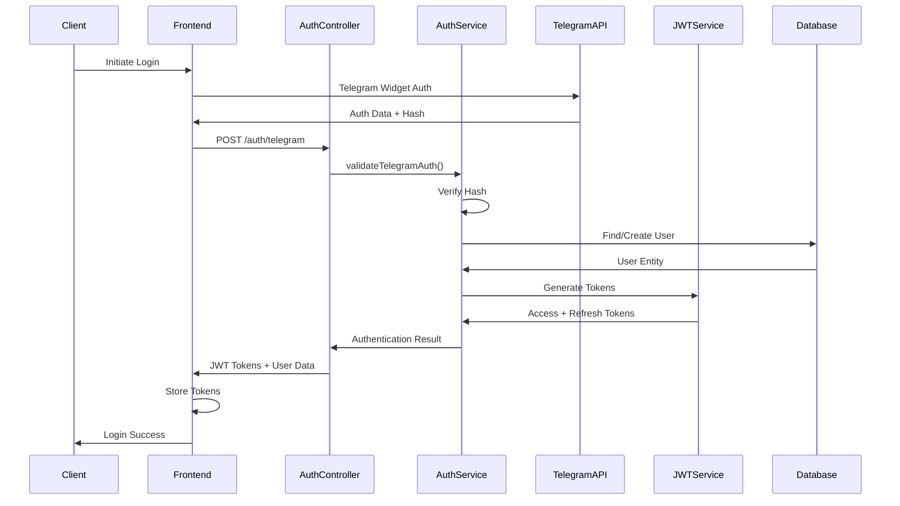

### Authorization Roles & Permissions

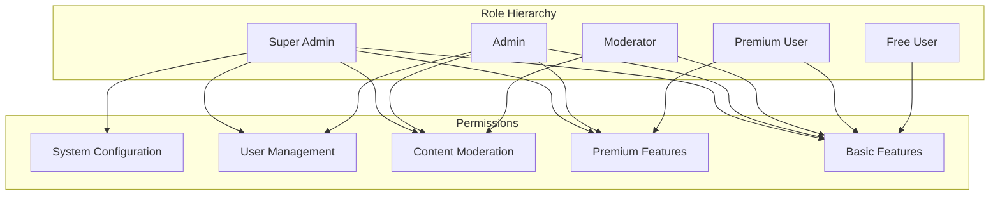

---

## 🔗 Интеграции

### External API Integration

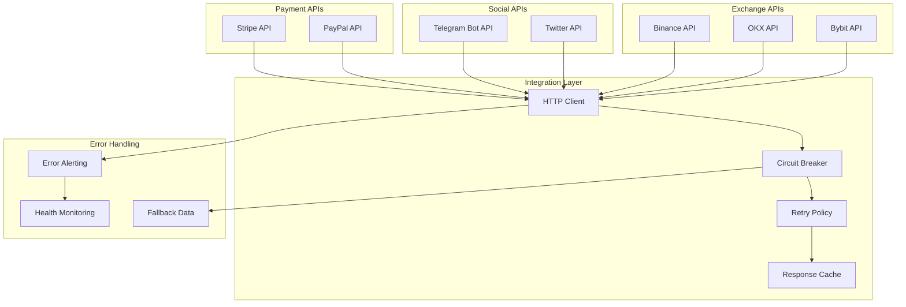

### API Integration Patterns

#### Circuit Breaker Pattern
```java
@Component
public class ExchangeApiClient {
    
    @CircuitBreaker(name = "binance-api", fallbackMethod = "getBinancePriceFallback")
    @Retry(name = "binance-api")
    @TimeLimiter(name = "binance-api")
    public CompletableFuture<PriceData> getBinancePrice(String symbol) {
        // API call implementation
    }
    
    public CompletableFuture<PriceData> getBinancePriceFallback(String symbol, Exception ex) {
        // Fallback implementation
        return getCachedPrice(symbol);
    }
}
```

#### Rate Limiting Strategy
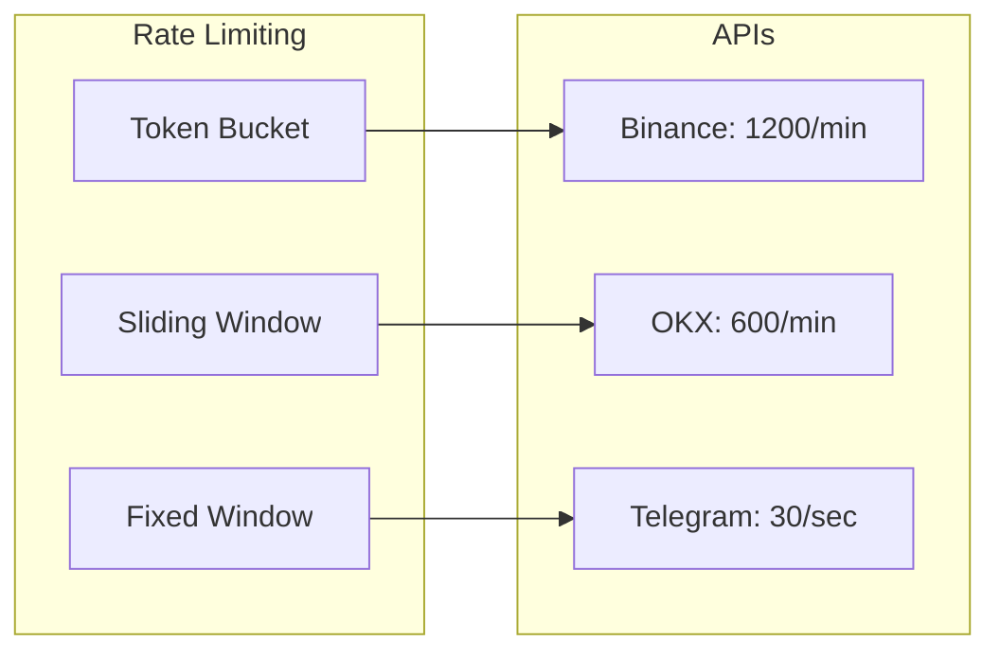

---

## 🚢 Развертывание

### Deployment Architecture

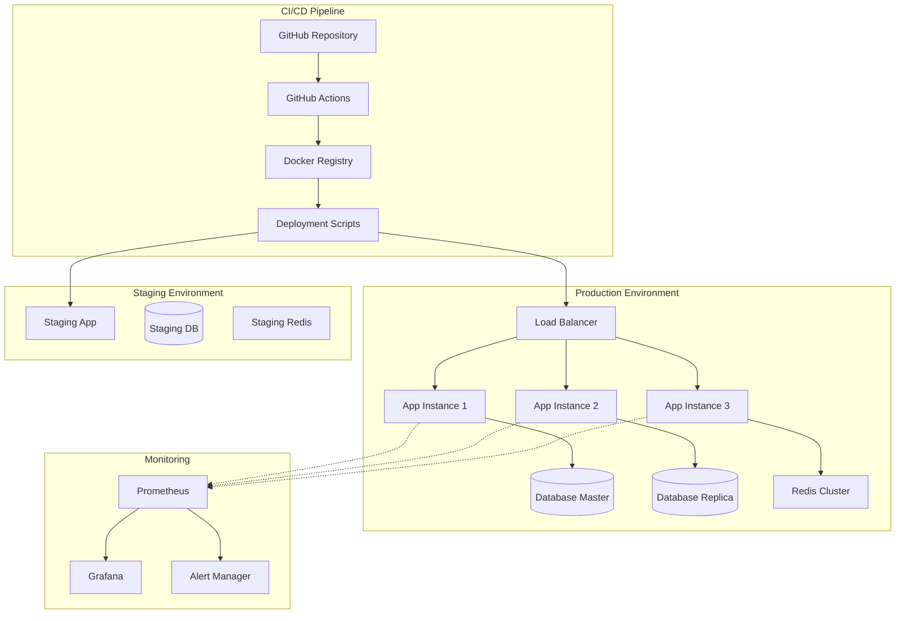

### Container Strategy

```dockerfile
# Multi-stage build for production
FROM openjdk:17-jre-slim as production

# Security: non-root user
RUN addgroup --system ct01 && adduser --system --group ct01

# Application setup
COPY target/ct01-api.jar /app/ct01-api.jar
COPY docker/entrypoint.sh /app/entrypoint.sh

RUN chmod +x /app/entrypoint.sh
RUN chown -R ct01:ct01 /app

USER ct01

# Health check
HEALTHCHECK --interval=30s --timeout=10s --start-period=60s --retries=3 \
    CMD curl -f http://localhost:8080/actuator/health || exit 1

EXPOSE 8080
ENTRYPOINT ["/app/entrypoint.sh"]
```

### Environment Configuration

```yaml
# docker-compose.prod.yml
version: '3.8'
services:
  app:
    image: ct01/api:latest
    ports:
      - "8080:8080"
    environment:
      - SPRING_PROFILES_ACTIVE=production
      - DATABASE_URL=${DATABASE_URL}
      - REDIS_URL=${REDIS_URL}
    deploy:
      replicas: 3
      resources:
        limits:
          memory: 1G
          cpus: '0.5'
    healthcheck:
      test: ["CMD", "curl", "-f", "http://localhost:8080/actuator/health"]
      interval: 30s
      timeout: 10s
      retries: 3
      start_period: 60s

  nginx:
    image: nginx:alpine
    ports:
      - "80:80"
      - "443:443"
    volumes:
      - ./nginx.conf:/etc/nginx/nginx.conf
      - ./ssl:/etc/nginx/ssl
    depends_on:
      - app
```

---

## 📊 Мониторинг и логирование

### Monitoring Stack

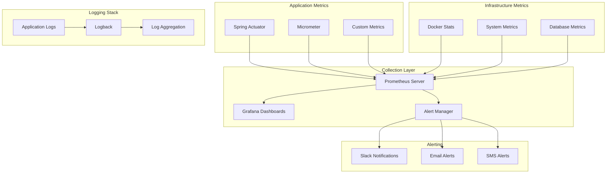

### Key Metrics Dashboard

```yaml
# Key Performance Indicators (KPIs)
metrics:
  application:
    - name: "Request Rate"
      query: "rate(http_requests_total[5m])"
      threshold: "100 req/sec"
    
    - name: "Response Time P99"
      query: "histogram_quantile(0.99, http_request_duration_seconds_bucket)"
      threshold: "< 2s"
    
    - name: "Error Rate"
      query: "rate(http_requests_total{status=~'5..'}[5m])"
      threshold: "< 1%"
  
  business:
    - name: "Active Users"
      query: "active_users_total"
      threshold: "> 100"
    
    - name: "Subscription Conversions"
      query: "rate(subscription_upgrades_total[1h])"
      threshold: "> 5%"
    
    - name: "API Usage by Plan"
      query: "sum by (plan_type) (rate(api_calls_total[5m]))"
      threshold: "Within limits"

  infrastructure:
    - name: "CPU Usage"
      query: "avg(cpu_usage_percent)"
      threshold: "< 80%"
    
    - name: "Memory Usage"
      query: "avg(memory_usage_percent)"
      threshold: "< 85%"
    
    - name: "Database Connections"
      query: "db_connections_active"
      threshold: "< 80% of pool"
```

---

## 📈 Scalability Strategy

### Horizontal Scaling Plan

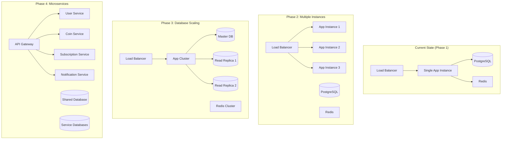

### Performance Optimization Strategy

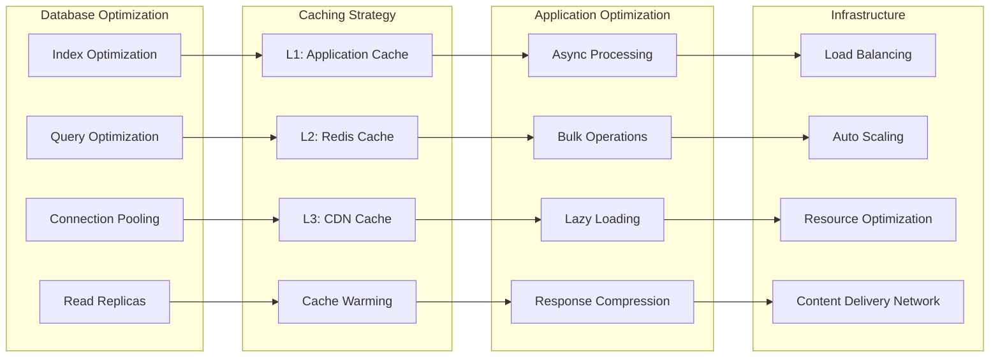

---

## 🔧 Development & Deployment Best Practices

### Code Quality Standards

```mermaid
graph TB
    subgraph "Code Standards"
        CHECKSTYLE[Checkstyle]
        SPOTBUGS[SpotBugs]
        PMD[PMD Analysis]
        SONAR[SonarQube]
    end
    
    subgraph "Testing Strategy"
        UNIT_TESTS[Unit Tests (80%)]
        INTEGRATION_TESTS[Integration Tests (15%)]
        E2E_TESTS[E2E Tests (5%)]
        PERFORMANCE_TESTS[Performance Tests]
    end
    
    subgraph "CI/CD Pipeline"
        BUILD[Build & Compile]
        TEST[Run Tests]
        SECURITY_SCAN[Security Scan]
        DEPLOY[Deploy]
    end
    
    subgraph "Quality Gates"
        CODE_COVERAGE[Code Coverage > 80%]
        SECURITY_CHECK[Security Scan Pass]
        PERFORMANCE_CHECK[Performance Baseline]
        MANUAL_REVIEW[Manual Code Review]
    end
    
    CHECKSTYLE --> BUILD
    SPOTBUGS --> BUILD
    PMD --> BUILD
    SONAR --> BUILD
    
    UNIT_TESTS --> TEST
    INTEGRATION_TESTS --> TEST
    E2E_TESTS --> TEST
    PERFORMANCE_TESTS --> TEST
    
    BUILD --> TEST
    TEST --> SECURITY_SCAN
    SECURITY_SCAN --> DEPLOY
    
    CODE_COVERAGE --> DEPLOY
    SECURITY_CHECK --> DEPLOY
    PERFORMANCE_CHECK --> DEPLOY
    MANUAL_REVIEW --> DEPLOY
```

---

## 📚 Resources & Documentation

### Architecture Decision Records (ADRs)

| Decision | Status | Date | Description |
|----------|--------|------|-------------|
| [ADR-001](./adr/001-spring-boot-framework.md) | Accepted | 2024-01-01 | Choice of Spring Boot as main framework |
| [ADR-002](./adr/002-postgresql-database.md) | Accepted | 2024-01-01 | PostgreSQL as primary database |
| [ADR-003](./adr/003-redis-caching.md) | Accepted | 2024-01-02 | Redis for caching and session management |
| [ADR-004](./adr/004-jwt-authentication.md) | Accepted | 2024-01-03 | JWT-based authentication strategy |
| [ADR-005](./adr/005-react-frontend.md) | Accepted | 2024-01-05 | React with TypeScript for frontend |

### Reference Links

- **[Spring Boot Documentation](https://spring.io/projects/spring-boot)**
- **[PostgreSQL Best Practices](https://wiki.postgresql.org/wiki/Performance_Optimization)**
- **[Redis Optimization Guide](https://redis.io/docs/management/optimization/)**
- **[React Performance Patterns](https://react.dev/learn/render-and-commit)**
- **[Docker Best Practices](https://docs.docker.com/develop/dev-best-practices/)**

---

<div align="center">

**[⬆️ Вернуться к началу](#system-architecture)**

🏗️ **Architecture is not about the design decisions you make, but about the decisions you delay** 🏗️

</div> 