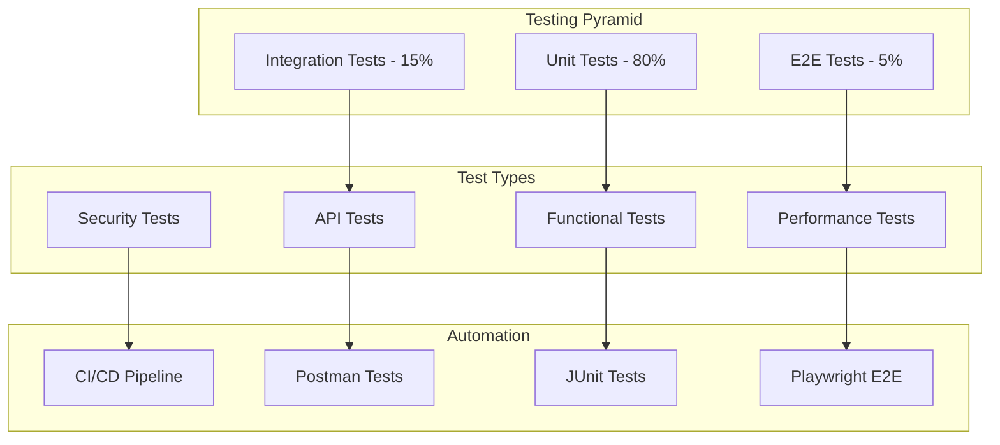

# Refactoring & Testing Roadmap

<div align="center">


**Comprehensive Refactoring Strategy для CT.01**

</div>

## 🗺️ Roadmap Overview

Этот документ содержит детальный план рефакторинга кода, создания тестов и улучшения качества проекта CT.01.

**Timeline:** 2-3 недели  
**Приоритет:** Высокий  
**Команда:** Development Team

---

## 📊 Current State Analysis

### ✅ Что уже завершено
- [x] Система аутентификации (Telegram + JWT)
- [x] Управление пользователями и ролями  
- [x] Система подписок с лимитами
- [x] API для данных бирж (Binance, OKX, Bybit)
- [x] WebSocket интеграции
- [x] Базовый frontend с React
- [x] Comprehensive документация

### ⚠️ Проблемные области (требуют рефакторинга)
- [ ] Неконсистентная обработка ошибок
- [ ] Отсутствие comprehensive тестирования
- [ ] Performance bottlenecks в API
- [ ] Security vulnerabilities
- [ ] Code duplication в контроллерах
- [ ] Database query optimization
- [ ] Frontend state management

---

## 🎯 Phase 1: Code Quality & Testing (Week 1)

### Day 1-2: API Testing Implementation

#### 1.1 Создание Postman Collection
```bash
# Структура тестов
postman/
├── CT01_API_Collection.json          # Основная коллекция
├── environments/
│   ├── development.json              # Dev окружение
│   ├── staging.json                  # Staging окружение  
│   └── production.json               # Prod окружение
├── test-data/
│   ├── users.json                    # Тестовые пользователи
│   ├── coins.json                    # Тестовые монеты
│   └── subscriptions.json            # Тестовые подписки
└── scripts/
    ├── pre-request.js                # Pre-request скрипты
    └── test.js                       # Test скрипты
```

**Задачи:**
- [ ] Создать полную Postman коллекцию для всех эндпоинтов
- [ ] Добавить автоматические тесты для каждого endpoint
- [ ] Настроить environments для dev/staging/prod
- [ ] Создать test data sets
- [ ] Добавить security тесты (OWASP)

#### 1.2 JUnit Integration Tests

**Priority Endpoints для тестирования:**
```java
// High Priority (Critical Business Logic)
@Test void testTelegramAuthentication()
@Test void testSubscriptionUpgrade()  
@Test void testCoinPriceRetrieval()
@Test void testTrackedCoinCRUD()
@Test void testRoleBasedAccess()

// Medium Priority (Important Features)
@Test void testUserProfileManagement()
@Test void testExchangeComparison()
@Test void testWebSocketConnections()
@Test void testSubscriptionLimits()

// Low Priority (Admin Features)  
@Test void testAdminUserManagement()
@Test void testSystemSettings()
@Test void testAuditLogging()
```

### Day 3-4: Code Refactoring

#### 1.3 Controller Layer Refactoring

**Проблема:** Code duplication и inconsistent error handling

**Решение:**
```java
// Создать базовый контроллер
@RestController
public abstract class BaseController {
    
    protected ResponseEntity<ApiResponse<T>> success(T data) {
        return ResponseEntity.ok(ApiResponse.success(data));
    }
    
    protected ResponseEntity<ApiResponse<T>> created(T data) {
        return ResponseEntity.status(HttpStatus.CREATED)
            .body(ApiResponse.success(data));
    }
    
    protected ResponseEntity<ApiResponse<Void>> noContent() {
        return ResponseEntity.noContent().build();
    }
}

// Стандартизировать response format
public class ApiResponse<T> {
    private boolean success;
    private T data;
    private String message;
    private String timestamp;
    // ... getters/setters
}
```

#### 1.4 Service Layer Improvements

**Задачи:**
- [ ] Выделить общие паттерны в service слои
- [ ] Добавить comprehensive validation
- [ ] Реализовать async processing где возможно
- [ ] Добавить circuit breaker для external APIs
- [ ] Улучшить error handling и logging

### Day 5: Database Optimization

#### 1.5 Query Performance Analysis

**Инструменты:**
```sql
-- Включить slow query log
SET global slow_query_log = 'ON';
SET global long_query_time = 1;

-- Analyze query performance
EXPLAIN ANALYZE SELECT ... ;

-- Check index usage
SELECT * FROM pg_stat_user_indexes;
```

**Задачи:**
- [ ] Проанализировать slow queries
- [ ] Оптимизировать существующие indexes
- [ ] Добавить недостающие indexes
- [ ] Реализовать connection pooling optimization
- [ ] Setup read replicas для readonly queries

---

## 🔒 Phase 2: Security & Performance (Week 2)

### Day 6-8: Security Hardening

#### 2.1 OWASP Security Review

**Security Checklist:**
```java
// Input Validation
@Valid @RequestBody UserCreateRequest request

// SQL Injection Prevention  
@Query("SELECT u FROM User u WHERE u.id = :id")

// XSS Prevention
@JsonIgnore private String sensitiveField;

// CSRF Protection
@EnableWebSecurity
@Configuration
public class SecurityConfig {
    @Bean
    public CsrfTokenRepository csrfTokenRepository() {
        return CookieCsrfTokenRepository.withHttpOnlyFalse();
    }
}
```

**Задачи:**
- [ ] Audit всех endpoints на security vulnerabilities
- [ ] Добавить input validation для всех requests
- [ ] Реализовать rate limiting per user/IP
- [ ] Улучшить JWT token security
- [ ] Добавить audit logging для sensitive operations
- [ ] Setup HTTPS enforcement
- [ ] Implement CORS policy

#### 2.2 Performance Optimization

**Bottleneck Areas:**
```java
// Caching Strategy
@Cacheable(value = "coin-prices", key = "#symbol")
public CoinPrice getCoinPrice(String symbol) { ... }

// Async Processing
@Async("taskExecutor")
public CompletableFuture<Void> sendNotification() { ... }

// Database Optimization
@EntityGraph(attributePaths = {"subscription", "roles"})
Optional<User> findByIdWithSubscription(Long id);
```

**Задачи:**
- [ ] Implement Redis caching для frequently accessed data
- [ ] Optimize database queries с batch processing
- [ ] Add async processing для non-critical operations  
- [ ] Implement connection pooling optimization
- [ ] Setup CDN для static assets
- [ ] Add response compression

### Day 9-10: Monitoring & Observability

#### 2.3 Application Monitoring

**Metrics Implementation:**
```java
// Custom Metrics
@Component
public class BusinessMetrics {
    
    private final MeterRegistry meterRegistry;
    private final Counter subscriptionUpgrades;
    private final Timer apiResponseTime;
    
    public BusinessMetrics(MeterRegistry meterRegistry) {
        this.meterRegistry = meterRegistry;
        this.subscriptionUpgrades = Counter.builder("subscription.upgrades")
            .description("Number of subscription upgrades")
            .register(meterRegistry);
    }
    
    public void recordSubscriptionUpgrade() {
        subscriptionUpgrades.increment();
    }
}
```

**Задачи:**
- [ ] Setup Spring Boot Actuator endpoints
- [ ] Implement custom business metrics
- [ ] Configure Prometheus integration
- [ ] Setup Grafana dashboards
- [ ] Add health checks для external dependencies
- [ ] Implement distributed tracing

---

## 🎨 Phase 3: Frontend & UX Improvements (Week 3)

### Day 11-13: Frontend Refactoring

#### 3.1 Component Architecture Review

**Current Issues:**
- Inconsistent state management
- Prop drilling
- Large component files
- No error boundaries

**Refactoring Strategy:**
```typescript
// Context для global state
interface AppState {
  user: User | null;
  subscription: Subscription | null;
  notifications: Notification[];
}

// Custom hooks для business logic
const useAuth = () => {
  const { user, setUser } = useContext(AuthContext);
  const login = useCallback(async (telegramData) => { ... });
  return { user, login, logout };
};

// Error boundaries
const ErrorBoundary: React.FC = ({ children }) => {
  // Error handling logic
};
```

#### 3.2 Performance Optimization

**Задачи:**
- [ ] Implement code splitting по route level
- [ ] Add React.memo для expensive components
- [ ] Optimize bundle size с tree shaking
- [ ] Implement virtualization для больших списков
- [ ] Add service worker для offline support
- [ ] Optimize images и assets

### Day 14-15: API Integration Improvements

#### 3.3 Real-time Data Management

**WebSocket Optimization:**
```typescript
// WebSocket hook с reconnection logic
const useWebSocket = (url: string) => {
  const [socket, setSocket] = useState<WebSocket | null>(null);
  const [connectionState, setConnectionState] = useState<'connecting' | 'open' | 'closed'>('closed');
  
  useEffect(() => {
    const ws = new WebSocket(url);
    
    ws.onopen = () => setConnectionState('open');
    ws.onclose = () => {
      setConnectionState('closed');
      // Reconnection logic
      setTimeout(() => setSocket(new WebSocket(url)), 5000);
    };
    
    setSocket(ws);
    return () => ws.close();
  }, [url]);
  
  return { socket, connectionState };
};
```

**Задачи:**
- [ ] Implement robust WebSocket connection management
- [ ] Add optimistic updates для better UX
- [ ] Implement proper error handling и retry logic
- [ ] Add loading states для all async operations
- [ ] Optimize re-renders с React.memo и useMemo

---

## 🧪 Phase 4: Testing & Quality Assurance

### Automated Testing Strategy



### Testing Implementation Plan

#### 4.1 Backend Testing (Days 1-5)
```java
// Unit Tests
@ExtendWith(MockitoExtension.class)
class UserServiceTest {
    
    @Mock private UserRepository userRepository;
    @Mock private SubscriptionService subscriptionService;
    
    @InjectMocks private UserService userService;
    
    @Test
    void shouldCreateUserSuccessfully() {
        // Arrange
        User user = new User("test@example.com");
        when(userRepository.save(any())).thenReturn(user);
        
        // Act
        User result = userService.createUser(user);
        
        // Assert
        assertThat(result.getEmail()).isEqualTo("test@example.com");
        verify(userRepository).save(user);
    }
}

// Integration Tests
@SpringBootTest(webEnvironment = SpringBootTest.WebEnvironment.RANDOM_PORT)
@TestPropertySource(locations = "classpath:application-test.properties")
class UserControllerIntegrationTest {
    
    @Autowired private TestRestTemplate restTemplate;
    @Autowired private UserRepository userRepository;
    
    @Test
    void shouldCreateUserEndToEnd() {
        // Test complete flow from HTTP request to database
    }
}
```

#### 4.2 API Testing (Days 6-8)
```javascript
// Postman Tests
pm.test("User registration successful", function () {
    pm.response.to.have.status(201);
    const response = pm.response.json();
    pm.expect(response.success).to.be.true;
    pm.expect(response.data.id).to.exist;
    
    // Store user ID for subsequent tests
    pm.environment.set("userId", response.data.id);
});

pm.test("Response time under 2 seconds", function () {
    pm.expect(pm.response.responseTime).to.be.below(2000);
});
```

#### 4.3 Performance Testing (Days 9-10)
```java
// JMeter equivalent in code
@Test
void loadTestCoinPriceEndpoint() {
    int threadCount = 100;
    int requestCount = 1000;
    
    ExecutorService executor = Executors.newFixedThreadPool(threadCount);
    CountDownLatch latch = new CountDownLatch(requestCount);
    
    for (int i = 0; i < requestCount; i++) {
        executor.submit(() -> {
            try {
                ResponseEntity<String> response = restTemplate.getForEntity(
                    "/api/v1/coins/BTC/price", String.class);
                assertThat(response.getStatusCode()).isEqualTo(HttpStatus.OK);
            } finally {
                latch.countDown();
            }
        });
    }
    
    boolean completed = latch.await(30, TimeUnit.SECONDS);
    assertThat(completed).isTrue();
}
```

---

## 📋 Implementation Checklist

### Week 1: Foundation
- [ ] **Day 1:** Setup Postman collection со всеми endpoints
- [ ] **Day 2:** Create automated API tests с validation
- [ ] **Day 3:** Refactor controllers для consistency
- [ ] **Day 4:** Improve service layer error handling
- [ ] **Day 5:** Database query optimization

### Week 2: Security & Performance  
- [ ] **Day 6:** Security audit и OWASP compliance
- [ ] **Day 7:** Implement rate limiting и input validation
- [ ] **Day 8:** Add comprehensive logging и monitoring
- [ ] **Day 9:** Setup caching strategy с Redis
- [ ] **Day 10:** Performance testing и optimization

### Week 3: Frontend & Integration
- [ ] **Day 11:** Frontend component refactoring
- [ ] **Day 12:** State management optimization
- [ ] **Day 13:** WebSocket connection improvements
- [ ] **Day 14:** E2E testing implementation
- [ ] **Day 15:** Final integration testing

---

## 🔧 Tools & Technologies

### Testing Tools
```bash
# Backend Testing
- JUnit 5 + Mockito
- Spring Boot Test
- TestContainers for integration tests
- WireMock for external API mocking

# API Testing  
- Postman + Newman
- REST Assured for Java
- Artillery.io for load testing

# Frontend Testing
- Jest + Testing Library
- Playwright for E2E tests
- Storybook for component testing

# Performance Testing
- JMeter
- Artillery.io
- Lighthouse for frontend performance
```

### Code Quality Tools
```yaml
# Static Analysis
checkstyle: Google Java Style
spotbugs: Security vulnerabilities
pmd: Code quality metrics  
sonarqube: Comprehensive analysis

# Coverage
jacoco: Java code coverage
nyc: JavaScript coverage
target: >80% line coverage

# Security
owasp-dependency-check: Known vulnerabilities
snyk: Real-time security monitoring
```

---

## 📊 Success Metrics

### Quality Metrics
- **Code Coverage:** >80% line coverage
- **Performance:** <2s API response time (95th percentile)  
- **Reliability:** <1% error rate
- **Security:** Zero high/critical vulnerabilities

### Testing Metrics
- **API Tests:** 100% endpoint coverage
- **Integration Tests:** All critical user journeys
- **Performance Tests:** All high-traffic endpoints
- **Security Tests:** OWASP Top 10 compliance

### Business Metrics
- **User Experience:** <3s page load time
- **Subscription Conversion:** >5% improvement
- **API Adoption:** External developer engagement
- **Reliability:** 99.9% uptime SLA

---

## 🚀 Getting Started

### Immediate Actions (Today)

1. **Setup Testing Environment**
```bash
# Install Newman for API testing
npm install -g newman

# Setup test database
docker run --name ct01-test-db -e POSTGRES_PASSWORD=test -p 5433:5432 -d postgres:13

# Configure test environment
cp backend/src/main/resources/application.properties backend/src/main/resources/application-test.properties
```

2. **Create First API Test**
```javascript
// Save as postman/basic-health-check.json
{
  "info": { "name": "CT01 Health Check" },
  "item": [
    {
      "name": "Health Check",
      "request": {
        "method": "GET",
        "url": "{{baseUrl}}/actuator/health"
      },
      "event": [
        {
          "listen": "test",
          "script": {
            "exec": [
              "pm.test('Health check passes', function() {",
              "  pm.response.to.have.status(200);",
              "  pm.expect(pm.response.json().status).to.equal('UP');",
              "});"
            ]
          }
        }
      ]
    }
  ]
}
```

3. **Run First Test**
```bash
newman run postman/basic-health-check.json \
  --environment postman/environments/development.json \
  --reporters cli,json \
  --reporter-json-export results.json
```

---

## 🎯 Next Steps

После завершения этого roadmap:

1. **Documentation Update** - обновить всю документацию
2. **Team Training** - обучить команду новым процессам
3. **CI/CD Integration** - интегрировать тесты в pipeline
4. **Monitoring Setup** - запустить полный monitoring stack
5. **Performance Baseline** - установить baseline metrics

---

<div align="center">

**[⬆️ Вернуться к началу](#refactoring--testing-roadmap)**

🔧 **"Quality is not an act, it is a habit"** - Aristotle 🔧

</div> 